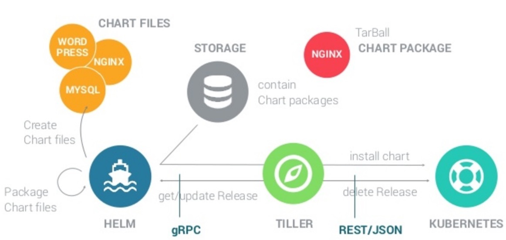
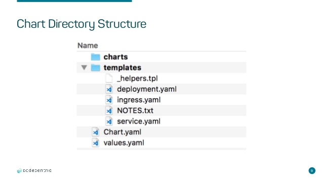

# Use Helm to Deploy Applications to AKS
A guide line of deploying a simple web application (jmalloc/echo-server) into AKS cluster by using Helm.

## Environment Preparation
### Install Docker on Windows 10
- Refer to [Install Docker Desktop on Windows](https://docs.docker.com/docker-for-windows/install/)
- Remember to switch on Hyper-V on Windows 10
    - Use 'Turn Windows Features on or off'  
- Remember to enable virtualization in your laptop's BIOS setting.

After the installation, try to run jmalloc/echo-server on your local environment:
```
docker run --detach --publish <Your Port>:80 -e PORT=80 --name echo2 jmalloc/echo-server
```
Click http://localhost:<Your Port>/.ws to access the echo-server.

### Install Azure CLI
### Create AKS Cluster on Azure
- Choose the latest version of Kubernetes (in order to avoid generating EXTERNAL-IP issue)
- Remember to enable RBAC
## Helm Installation and Configuration on Windows 10
Refer to [Installing Helm](https://helm.sh/docs/using_helm/)
```
choco install kubernetes-helm
helm version
```
## Write a Simple Helm Chart
Create your own helm chart.
```
C:\<Your Path>>mkdir charts
C:\<Your Path>>cd charts
C:\<Your Path>\charts> helm create samplechart
Creating samplechart
```
Then your samplechart directory will look like the following:


Edit values.yaml, deployment.yaml and service.yaml.

Verify dependencies and templates.
```
C:\<Your Path>\charts> helm lint samplechart
==> Linting samplechart
[INFO] Chart.yaml: icon is recommended
```
Package helm chart (add --debug to get more information)
```
C:\<Your Path>\charts> helm package samplechart
Successfully packaged chart and saved it to: C:\<Your Path>\charts\samplechart-0.1.0.tgz
```
Check if this application has been successfuly published to the repository.
```
C:\<Your Path>\charts> helm search samplechart
NAME                    CHART VERSION   APP VERSION     DESCRIPTION
local/samplechart       0.1.1           1.0             A Helm chart for Kubernetes
```
If you cannot get the application, it is probably because your chart has not been managed by Helm. Then you need to start a local Repository server.
## Deploy the Applicatin to AKS Cluster
Log in Azure if needed.
```
az login
```
Get the credentials for connecting AKS cluster.
```
az aks get-credentials --resource-group <ResourceGroupName> --name <ClusterName>
```
Check if you've connected to the AKS cluster.
```
kubectl get pods
```
Create a service account and role binding for the Tiller service.
```
kubectl apply -f helm-rbac.yaml
```
Configure Helm (only work for cmd)
```
helm init --service-account tiller --node-selectors "beta.kubernetes.io/os"="linux"
```
Install Helm chart (dry run)
```
helm install --dry-run --debug local/samplechart
```
If everything is OK, install Helm chart
```
helm install local/samplechart --name sampleapp
```
Check the installation
```
kubectl get services
```
Watch the service until it gets a external IP. It usually takes about 2 mins.
```
kubectl get service sampleapp-samplechart --watch
```
Access the URL in cmd
```
curl http://<external-ip>:port
```
Or type the following URL in your browser
```
http://<external-ip>:port/.ws
```
The application will echo your input.

## Other Helm Operations
To upgrade your application, first change the version in Chart.yaml. Then re-package the chart.
```
helm package samplechart
```
The upgrade command will automatically get the latest version of your application. You can also use `--version:xxx` to define which version you want to move to.
```
helm upgrade sampleapp local/samplechart
```
Delete your application
```
helm delete sampleapp
```

## References
- [Helm Introduction](https://www.hi-linux.com/posts/21466.html)
- [Install applications with Helm in Azure Kubernetes Service (AKS)](https://docs.microsoft.com/en-us/azure/aks/kubernetes-helm)
- [Youtube: Deploy to AKS using Helm](https://www.youtube.com/watch?v=DczwTQE5T2M)